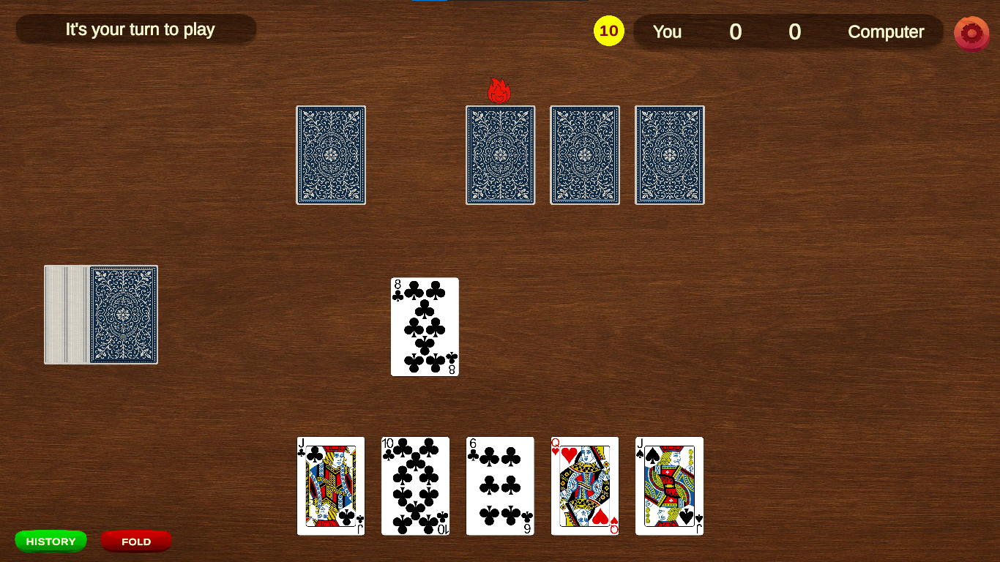
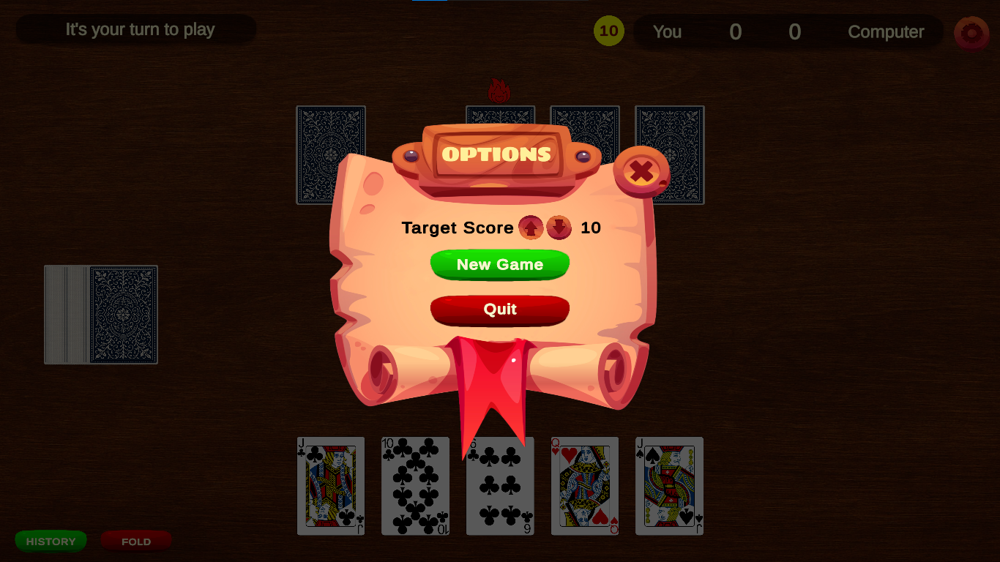

# Card Masters

A strategic Unity-based card game where players compete to control tricks and accumulate points through clever card play. Built with engaging animations and AI opponent.

## 🎮 Game Overview

Card Masters is a trick-taking card game featuring a unique scoring system where players strategically play cards to maintain control and accumulate points. Players use a reduced deck (6-K) and compete in rounds where the goal is to reach a target score through strategic card play.

## 📸 Screenshots

    
    

## 🎯 Game Rules & Gameplay

### Setup

- **Cards Used**: 6 through 10, Jack, Queen, and King of each suit (♦♠♥♣)
- **Deal**: Each player receives 5 cards (3 initially, then 2 more)
- **Players**: 1 Human vs 1 AI Computer opponent

### Core Gameplay

1. **Starting**: First card recipient begins the round
2. **Control**: Current controlling player leads with any card
3. **Following**: Players must follow suit if possible, otherwise play any card
4. **Winning Control**: Play a higher card of the led suit to gain control
5. **Round End**: After 5 cards played, controlling player wins the round

### Scoring System

The game features a sophisticated scoring mechanism:

#### Point Values

- **6**: 3 points (when maintaining control)
- **7**: 2 points (when maintaining control)
- **8-K**: 1 point (always)

#### Accumulation Rules

- **Same Suit**: Only the most recent card counts
- **Different Suits**: Points accumulate across suits
- **Control Loss**: Accumulated points reset to 0
- **Final Winner**: Only the round winner adds accumulated points

#### Examples

- **6♦ → 7♠**: 5 points (3+2, different suits)
- **7♣ → 6♣**: 3 points (only 6 counts, same suit)
- **Control Transfer**: Only 1 point instead of card value

### Winning

- **Target**: First player to reach predefined score (default: 10 points)
- **Persistence**: Scores carry over between rounds and reshuffles

View [Game Play Rules](Game_Play_Rules.md) for the full ruleset.

## 🛠️ Technical Implementation

### Architecture

Built using Unity 2022.3+ with C# scripting.

#### Core Scripts

- **`GameManager.cs`** : Central game state management, scoring, round handling
- **`CardsSetup.cs`** : Deck creation, card dealing, animations
- **`CardUI.cs`** : Individual card interaction and movement
- **`CardShake.cs`** : Card animation effects
- **`ChooseCardAI.cs`** : Computer opponent AI logic

#### Key Features

- **Animation System**: Smooth card movements with coroutines
- **AI Opponent**: Strategic card-playing algorithm
- **UI System**: Score tracking, control indicators, game history
- **Settings**: Adjustable target score (1-30 points)
- **Persistence**: Score retention between sessions

## 🚀 Getting Started

### Prerequisites

- Unity 2022.3 LTS or later
- .NET Framework 4.7.1+
- Visual Studio or compatible IDE | *VS Code plus extensions works*

### Installation

1. **Clone or Download** the project files
2. **Open Unity Hub** and add the project
3. **Open Scene**: Load the main game scene
4. **Play**: Press Play in Unity Editor or build for target platform

## 🎮 How to Play

### Controls

- **Mouse**: Click cards to play them
- **Settings**: Adjust target score via +/- buttons
- **Reset**: Restart game with new deck
- **Fold**: Forfeit current round (if enabled)

### Game Flow

1. **Start**: Game deals 5 cards to each player
2. **Your Turn**: Click a card to play it
3. **AI Turn**: Computer plays automatically
4. **Round End**: Winner gets points based on card combinations
5. **Continue**: Play continues until target score reached

## 🎯 Future Enhancements

- Multiplayer support (local/online)
- Additional AI difficulty levels
- Sound effects and music
- Custom card backs and themes
- Statistics tracking
- Tournament mode

## 🤝 Contributing

Contributions are welcome. Areas for improvement:

- AI strategy enhancement
- Additional game modes
- UI/UX improvements
- Sound and music integration
- Mobile optimization
